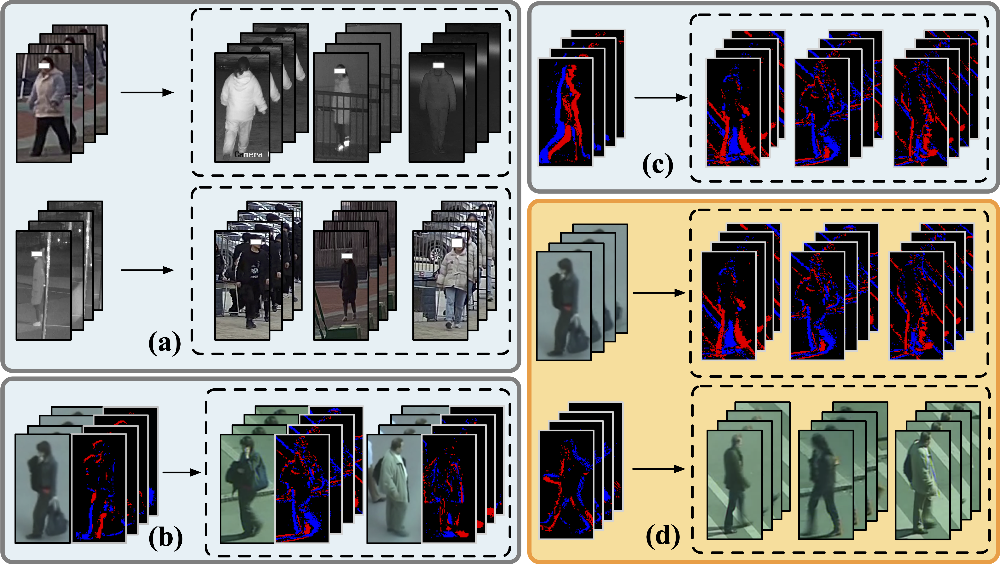

# Event-RGB-ReID (ASP-DAC 2026)

This repository contains the official implementation for our paper **"Video-based Visible-Event Cross-modal Person Re-identification for Edge AI Surveillance Systems"** accepted by ASP-DAC 2026. We introduce a novel cross-modal task that matches identities across RGB and event camera modalities, proposing a method that constructs auxiliary modalities using frequency information to achieve significant improvements over existing methods.



## Environment Setup

```bash
conda create -n event python=3.9
conda activate event
pip install -r requirements.txt
```

## Data Processing

We store the event-image binary arrays in `.npy` files, where the red and blue channels represent brightness-increase and brightness-decrease events, respectively.

### Event Camera Image Data Generation

Event data is generated from RGB images using the [v2e](https://github.com/SensorsINI/v2e), producing DVS_TEXT files that contain timestamps, pixel coordinates, and polarity of brightness changes. For a given time window, the brightness changes at each pixel are accumulated to produce the final event image.

The script hitsz/mars_gen.py, which should be placed in the [v2e](https://github.com/SensorsINI/v2e) directory by default, is used to generate the event data for the HITSZ dataset.

### PRID2011

The PRID2011 dataset used in this project is sourced from the [SDCL repository](https://github.com/Chengzhi-Cao/SDCL).

After downloading the raw data, we perform filtering and split the remaining identities into training and testing subsets. The lists of identities for each split are provided in `data/PRID2011/train.json` and `data/PRID2011/test.json`.

Once prepared, organize the directory structure to match the following layout:

```
data/
└── PRID2011/
    ├── prid_rgb/
    ├── prid_event/
    ├── train.json
    └── test.json
```

### MARS

The MARS dataset is obtained from the [official evaluation repository](https://github.com/liangzheng06/MARS-evaluation) and should be downloaded into `data/mars`.

Following the official processing script, the RGB frames for each tracklet are stored under a folder hierarchy such as `data/mars/bbox_train/0001/C1/T0001/F001.jpg`. Create an additional `rgb` folder for every identity to hold the raw RGB images, resulting in paths like `data/mars/bbox_train/0001/rgb/C1/T0001/F001.jpg`.

Convert the RGB frames to the event-image representation with [v2e](https://github.com/SensorsINI/v2e) using the default parameter settings. Save the converted frames in a sibling `npy` directory that mirrors the RGB structure, for example `data/mars/bbox_train/0001/npy/C1/T0001/F001.npy`.

The predefined training and testing splits are provided in `data/mars/train.json` and `data/mars/test.json`.

The prepared directory should resemble the following structure:

```
data/
└── mars/
    ├── bbox_train/
    │   └── ...
    │       ├── event/
    │       └── rgb/
    ├── bbox_test/
    │   └── ...
    ├── info/
    ├── train.json
    └── test.json
```

### VCM-HITSZ

The VCM-HITSZ dataset can be obtained from the [official project repository](https://github.com/VCM-project233/HITSZ-VCM-data). After downloading, place the contents under `data/VCM-HITSZ` with the three provided folders: `Train`, `Test`, and `info`.

Create an additional directory `data/VCM-HITSZ/VCM_event` to store the event-domain samples. Convert each RGB image to the event representation with [v2e](https://github.com/SensorsINI/v2e) using the default parameters, and mirror the original hierarchy beneath `VCM_event`. For instance, an RGB frame located at `data/VCM-HITSZ/Train/0004/rgb/D2/6.jpg` should produce the event file `data/VCM-HITSZ/VCM_event/Train/0004/npy/D2/0006.npy`.

For the VCM-HITSZ dataset, since the original images may have different sizes, they should be resized to a predefined resolution before conversion with v2e.

We provide pre-defined splits in `data/VCM-HITSZ/train.json` and `data/VCM-HITSZ/test.json`.

The expected folder layout is illustrated below:

```
data/
└── VCM-HITSZ/
    ├── Train/
    ├── Test/
    ├── info/
    ├── VCM_event/
    │   ├── Train/
    │   └── Test/
    ├── train.json
    └── test.json
```

## Training

Run the training scripts for different datasets:

### PRID2011
```bash
bash scripts/PRID.sh
```

### VCM-HITSZ
```bash
bash scripts/VCM.sh
```

### MARS
```bash
bash scripts/MARS.sh
```

## Citation

If you find this work useful, please cite our paper:

```bibtex
@inproceedings{zhang2026video,
  title = {Video-based Visible-Event Cross-modal Person Re-identification for Edge AI Surveillance Systems},
  author = {Xinyun Zhang and Zixiao Wang and Yurui Kuang and Bei Yu},
  booktitle = {Proceedings of the 31st Asia and South Pacific Design Automation Conference},
  year = {2026},
}
```
